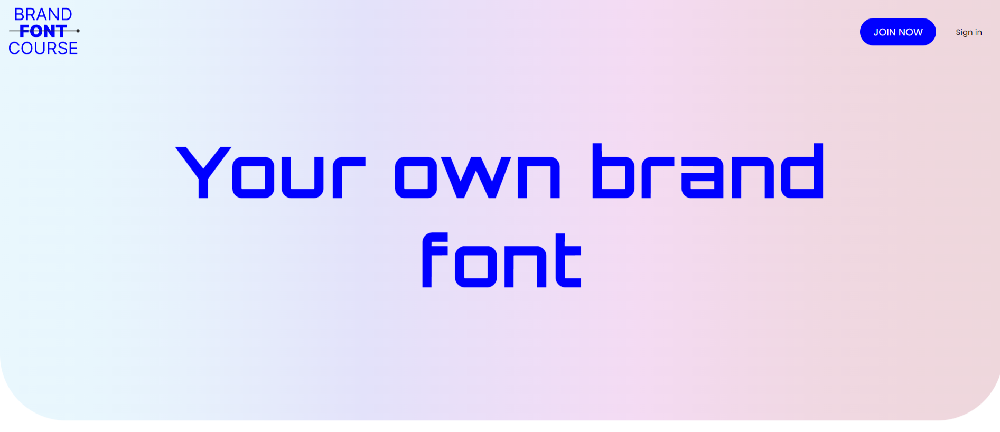
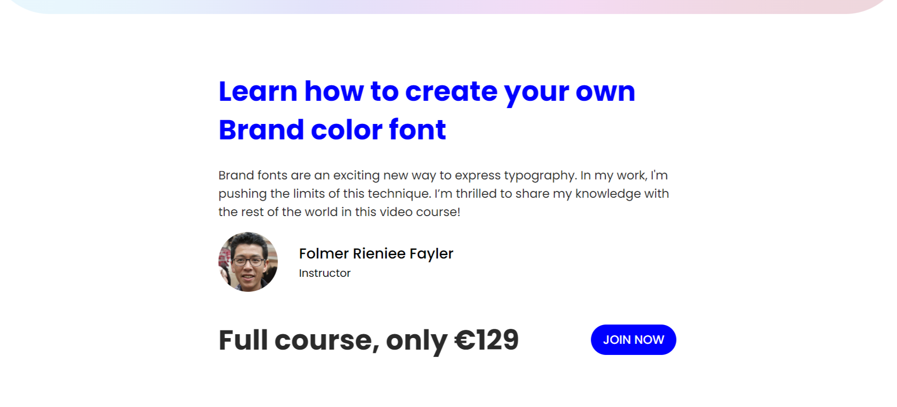
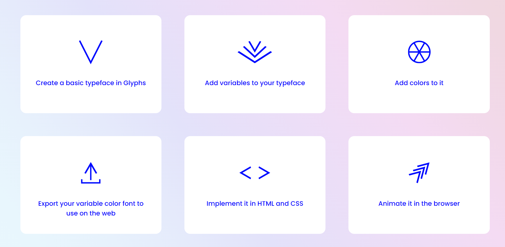
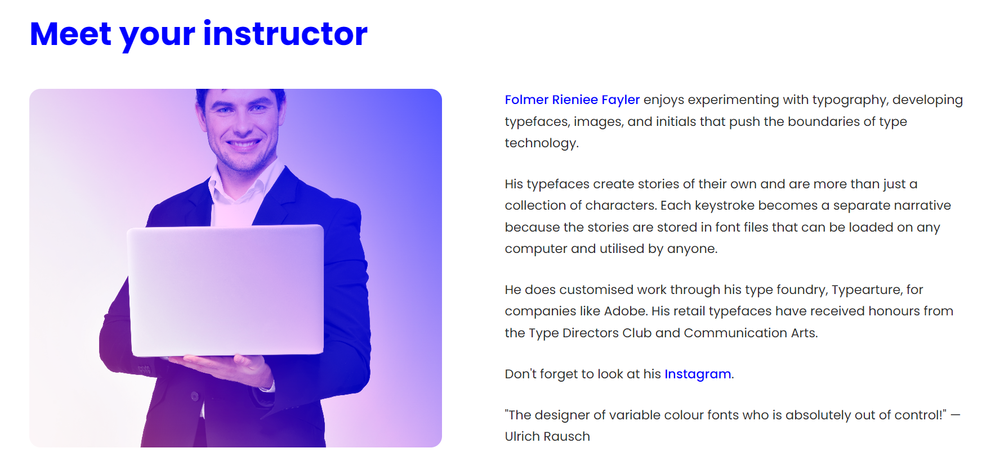
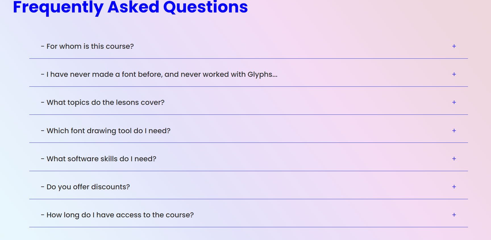
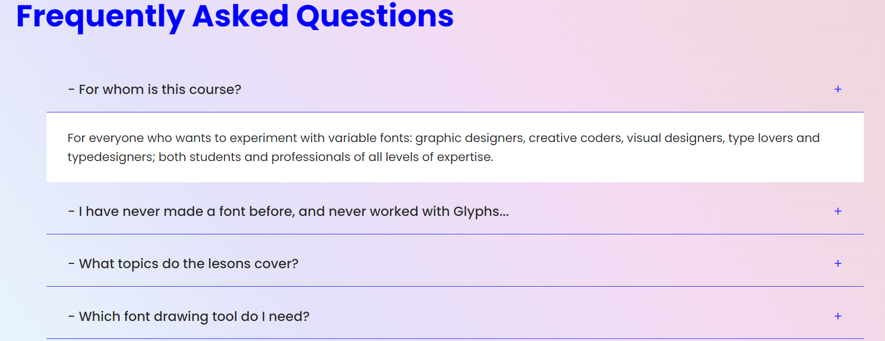
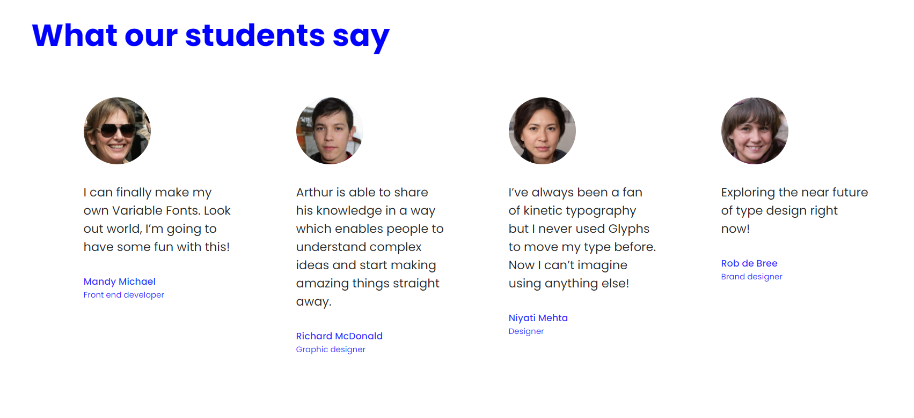
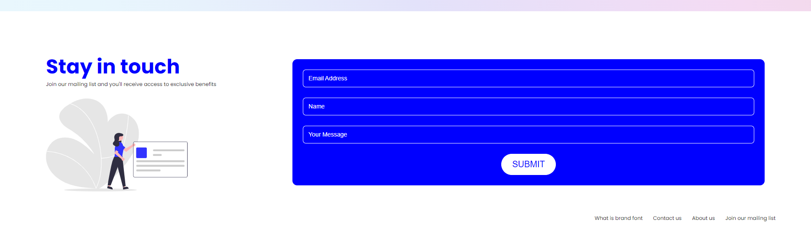

# Brand Font Course.

This is an responsive template with HTML , CSS , SCSS and some ::functionality:: with JS.

## Features

BrandFontCourse template used this technologies :
- HTML.
- CSS.
- SCSS (To display an animation).
- JS (To add functionality in FAQs section).

### Header Section

-> Using a linear-gradient background , set height to 85 of viewport with a simple navigation has 2 buttons.

### Hero Section

-> Simple Hero Section With h2 and paragraph.

### Animation Section

-> ::LEARN ANIMATION:: with simple animation using SCSS.!

*Between Animation And Learning Grid there is an embedded video to watch the trailer*

### Learn Section

-> By CSS grid we make 3 columns & 2 rows with gaps

### Meet Section

-> Small breif about instructor , *Fake Image* and *Fake Text* 

### FAQs Section

-> Frequently Asked Questions with some data from a website i used as a resource .. will be mentioned at the end.

-> Here we use a functionality by JavaScript to make an event onClick on paragraph it will show a small box under it include an answer.

### Students Section

-> Here AGAIN we used *Fake Images* and text taken from resources.
by a grid with 4 cols and flexbox to justify content. 

### CallToAction Section

-> With huge title and nice card present an information to user to purchase course.

### Footer Section

-> By grid with 0.5fr and 1fr cols , text has 0.5fr 

## Resources.
- Inspiration and Content -> https://variablefontcourse.com/
- Illustration -> https://undraw.com
*SemiClone of VariableFontCourse website*.